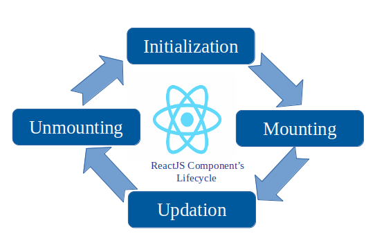

# ReactJS

## DAFTAR ISI

- [Sejarah React](#SEJARAH-REACT)
- [Kenapa Memilih React](#KENAPA-MEMILIH-REACT)
- [Lifesicle React](#LIFECYCLE-RAEACT)
- [Memulai dengan CDN](#MEMULAI-REACT-DENGAN-CDN)
- [Memulai React dengan NodeJS](#MEMULAI-REACT-DENGAN-NODEJS)
- [Setup VSCode](#SETUP-VSCODE)
- [Mengenal ES6](#ES6)
  - [Apa itu ES6](#APA-ITU-ES6)
  - [ES6 Class](#ES6-CLASS)
  - [ES6 Arrow Function](#ES6-ARROW-FUNCTION)
  - [ES6 Variable](#ES6-VARIABLE)
  - [ES6 Array Method](#ES6-ARRAY-METHOD)
  - [ES6 Destructuring](#ES6-DESTRUCTURING)
  - [ES6 Spread Operator](#ES6-SPREAD-OPERATOR)
  - [ES6 Modules](#ES6-MODULES)
  - [ES6 Ternary Operator](#ES6-TERNARY-OPERATOR)
- [React Render HTML](#REACT-RENDER-HTML)
- [React JSX](#REACT-JSX)
- [React Components](#REACT-COMPONENTS)
- [React State](#REACT-STATE)
- [React Props](#REACT-PROPS)
- [State Vs. Props](#State-Vs-Props)
- [Constructor](#Constructor)
- [React API](#React-API)
- [React Form](#React-Form)
- [React Event](#React-Events)

## SEJARAH REACT
React JS adalah sebuah **library JavaScript** untuk membangun antarmuka pengguna. React JS digunakan untuk membuat aplikasi satu halaman. React JS memungkinkan kita untuk membuat komponen UI yang dapat digunakan kembali. React JS juga mendukung sintaks JSX, yang merupakan ekstensi sintaks JavaScript yang memudahkan kita untuk menulis kode dan markup dalam satu file¹.

React JS adalah sebuah library, bukan sebuah framework. Ini berarti React JS tidak menentukan bagaimana kita melakukan routing dan pengambilan data. Untuk membuat aplikasi lengkap dengan React JS, kita bisa menggunakan framework full-stack seperti Next.js atau Remix.

React JS dibuat oleh **Jordan Walke** yang merupakan seorang programmer di Facebook. Ia mengembangkan prototype pertama React JS dengan nama **FaxJS** pada tahun 2011 dan menerapkannya pada fitur pencarian milik Facebook. Pada tahun 2012, FaxJS disempurnakan menjadi React JS dan diimplementasikan pada fitur periklanan Facebook dan Instagram¹. React JS kemudian dirilis secara open source pada tahun 2013².

Daftar versi release React JS bisa dilihat di [ReactJS](https://reactjs.org/versions). Berikut ini adalah beberapa versi terbaru dari React JS beserta changelog-nya:

- **React 18.2.0**: Menambahkan fitur `useSyncExternalStore` dan `useId`.
- **React 18.1.0**: Menambahkan fitur `useDeferredValue` dan `useTransition`.
- **React 18.0.0**: Menambahkan fitur automatic batching, streaming server-side rendering, dan concurrent rendering.
- **React 17.0.2**: Memperbaiki beberapa bug dan masalah kompatibilitas.
- **React 17.0.1**: Memperbaiki beberapa bug dan masalah kompatibilitas.
- **React 17.0.0**: Menambahkan fitur event delegation, no event pooling, dan gradual adoption strategy.

## KENAPA MEMILIH REACT
Ada banyak alasan mengapa harus memilih React untuk membuat aplikasi web, di antaranya adalah:

- **Mudah digunakan**. Developer yang sudah memahami JavaScript bisa mempelajari cara menggunakan React dengan cepat karena library ini bergantung sepenuhnya pada JavaScript dan metode berbasis komponen.
- **Mendukung komponen yang reusable**. Dengan React, Anda bisa menggunakan lagi komponen yang sudah dikembangkan menjadi aplikasi. Ini bisa menghemat waktu dan biaya pengembangan.
- **Mudah untuk menulis komponen**. React mendukung sintaks JSX, yang merupakan ekstensi sintaks JavaScript yang memudahkan kita untuk menulis kode dan markup dalam satu file.
- **Performa tinggi**. React menggunakan Virtual DOM, yang merupakan representasi ringan dari DOM asli. Virtual DOM memungkinkan React untuk melakukan perubahan UI secara efisien dan cepat.
- **SEO-friendly**. React dapat melakukan server-side rendering, yang berarti UI dapat dirender di sisi server sebelum dikirim ke browser. Ini bisa meningkatkan performa dan SEO aplikasi web.
- **Learn once, write anywhere**. React dapat digunakan untuk membuat aplikasi web maupun mobile dengan menggunakan React Native. Ini bisa memberikan fleksibilitas dan konsistensi bagi developer.
- **Dibangun dan dikembangkan oleh Facebook**. React merupakan library yang populer dan banyak digunakan oleh perusahaan-perusahaan teknologi ternama, seperti Netflix, Airbnb, WhatsApp, dan lain-lain. Ini menunjukkan bahwa React memiliki komunitas yang besar dan dukungan yang kuat.
- **Terus berkembang dan berinovasi**. React selalu menghadirkan fitur-fitur baru dan menarik di setiap versi rilisnya, seperti automatic batching, startTransition, streaming server-side rendering, concurrent rendering, dan lain-lain. Ini membuat React selalu up-to-date dengan kebutuhan developer dan pengguna.

## LIFECYCLE RAEACT


State dan lifecycle adalah dua konsep penting dalam React JS yang berhubungan dengan data dan perilaku komponen. Berikut adalah penjelasannya:

- **State** adalah objek yang menentukan bagaimana komponen bereaksi terhadap perubahan data. State bersifat pribadi dan sepenuhnya dikendalikan oleh komponen. State bisa diubah dengan menggunakan fungsi setState(), yang akan memicu perubahan UI sesuai dengan state terbaru.
- **Lifecycle** adalah siklus hidup dari komponen, yang terdiri dari tiga fase: mounting, updating, dan unmounting. Setiap fase memiliki metode khusus yang bisa digunakan untuk mengatur logika komponen. Misalnya, metode componentDidMount() akan dipanggil ketika komponen berhasil dimount ke DOM, dan metode componentWillUnmount() akan dipanggil ketika komponen akan dihapus dari DOM.

State dan lifecycle saling berhubungan karena perubahan state bisa memicu pemanggilan metode lifecycle. Misalnya, ketika kita memanggil setState(), React akan membandingkan state sebelum dan sesudah perubahan, dan memanggil metode render() untuk merender ulang UI. Kemudian, React juga akan memanggil metode componentDidUpdate() untuk memberitahu kita bahwa komponen sudah diperbarui.

## MEMULAI REACT DENGAN CDN
Untuk memulai React dengan CDN, ada beberapa jal yang harus dilakukan:

- Pertama, Anda perlu menambahkan skrip CDN untuk React, React DOM, dan Babel di bagian `<head>` file HTML Anda. Ini akan memuat pustaka-pustaka yang diperlukan untuk menjalankan React di browser Anda.
- Kedua, Anda perlu membuat sebuah komponen React yang akan menampilkan UI Anda. Anda dapat menggunakan sintaks JSX untuk menulis elemen HTML di dalam kode JavaScript. Anda juga dapat menggunakan kelas atau fungsi untuk membuat komponen React.
- Ketiga, Anda perlu me-render komponen React ke dalam elemen HTML tertentu di halaman Anda. Anda dapat menggunakan `ReactDOM.render()` untuk melakukan ini. Anda perlu memberikan dua argumen: komponen React yang ingin Anda tampilkan, dan elemen HTML yang ingin Anda gunakan sebagai kontainer.
- Keempat, Anda dapat menambahkan gaya dan fungsionalitas tambahan ke aplikasi React Anda dengan menggunakan pustaka-pustaka lain seperti Bootstrap, Axios, Redux, dll. Anda dapat menautkan skrip CDN untuk pustaka-pustaka ini di bagian `<head>` file HTML Anda juga.

Berikut adalah contoh kode sederhana untuk membuat aplikasi React dengan CDN:

```html
<!DOCTYPE html>
<html>
<head>
  <meta charset="utf-8" />
  <title>Belajar Reactjs</title>
  <!-- Skrip CDN untuk React, React DOM, dan Babel -->
  <script src="https://unpkg.com/react@18/umd/react.development.js" crossorigin></script>
  <script src="https://unpkg.com/react-dom@18/umd/react-dom.development.js" crossorigin></script>
  <script src="https://unpkg.com/@babel/standalone/babel.min.js"></script>
</head>
<body>
  <!-- Elemen HTML yang akan digunakan sebagai kontainer untuk komponen React -->
  <div id="app"></div>
  <!-- Skrip JSX yang akan dikompilasi oleh Babel menjadi JavaScript biasa -->
  <script type="text/babel">
    // Membuat komponen React dengan kelas
    class Hello extends React.Component {
      // Metode render yang akan mengembalikan elemen JSX
      render() {
        return <h1>Halo Dunia Reactjs!</h1>
      }
    }

    // Me-render komponen Hello ke dalam elemen dengan id "app"
    ReactDOM.render(<Hello/>, document.getElementById("app"));
  </script>
</body>
</html>
```

## MEMULAI REACT DENGAN NODEJS
Untuk memulainya ada beberapa langkah yang perlu Anda lakukan:

- Pertama, Anda perlu menginstal Node.js dan npm di komputer Anda. Node.js adalah lingkungan runtime JavaScript yang memungkinkan Anda menjalankan kode JavaScript di sisi server. Npm adalah manajer paket untuk Node.js yang memudahkan Anda menginstal dan mengelola pustaka-pustaka yang dibutuhkan oleh aplikasi React Anda.
- Kedua, Anda perlu menginstal create-react-app, sebuah alat yang memudahkan Anda membuat dan menjalankan proyek React. Anda dapat menginstal create-react-app secara global dengan menggunakan perintah `npm install -g create-react-app` di terminal atau command prompt Anda.
- Ketiga, Anda perlu membuat proyek React baru dengan menggunakan create-react-app. Anda dapat melakukannya dengan menggunakan perintah `npx create-react-app nama-proyek` di terminal atau command prompt Anda, di mana `nama-proyek` adalah nama yang Anda inginkan untuk proyek Anda. Perintah ini akan membuat folder baru dengan nama proyek Anda dan mengisi folder tersebut dengan file-file yang diperlukan untuk aplikasi React Anda.
- Keempat, Anda perlu menjalankan aplikasi React Anda dengan menggunakan perintah `npm start` di terminal atau command prompt Anda. Perintah ini akan menjalankan server pengembangan lokal yang akan membuka browser Anda dan menampilkan aplikasi React Anda. Anda dapat mengedit file-file di folder proyek Anda dan melihat perubahan secara langsung di browser.

Berikut adalah contoh output dari perintah-perintah di atas¹:

```bash
$ npm install -g create-react-app
+ create-react-app@4.0.3
added 67 packages from 23 contributors in 5.782s

$ npx create-react-app belajar-react
npx: installed 67 in 6.223s

Creating a new React app in D:\belajar-react.

Installing packages. This might take a couple of minutes.
Installing react, react-dom, and react-scripts with cra-template...

added 1906 packages from 704 contributors and audited 1910 packages in 138.057s

170 packages are looking for funding
  run `npm fund` for details

found 0 vulnerabilities


Initialized a git repository.

Success! Created belajar-react at D:\belajar-react
Inside that directory, you can run several commands:

  npm start
    Starts the development server.

  npm run build
    Bundles the app into static files for production.

  npm test
    Starts the test runner.

  npm run eject
    Removes this tool and copies build dependencies, configuration files
    and scripts into the app directory. If you do this, you can’t go back!

We suggest that you begin by typing:

  cd belajar-react
  npm start

Happy hacking!

$ cd belajar-react
$ npm start

> belajar-react@0.1.0 start D:\belajar-react
> react-scripts start

Starting the development server...

Compiled successfully!

You can now view belajar-react in the browser.

  Local:            http://localhost:3000
  On Your Network:  http://192.168.1.100:3000

Note that the development build is not optimized.
To create a production build, use npm run build.
```
## SETUP VSCODE
Untuk install Visual Studio Code dan setup extension untuk React project, kita bisa mengikuti langkah-langkah berikut:

1. Download dan install Visual Studio Code dari situs resminya (https://code.visualstudio.com/). Pilih versi yang sesuai dengan sistem operasi kita.
2. Download dan install Node.js dari situs resminya (https://nodejs.org/). Node.js dibutuhkan untuk menjalankan aplikasi React dan npm (Node.js package manager) yang digunakan untuk menginstal paket-paket yang dibutuhkan oleh React.
3. Buka Visual Studio Code dan klik pada menu "Extensions" (Ctrl+Shift+X) di sisi kiri. Cari dan install beberapa ekstensi yang berguna untuk pengembangan React, seperti:

- ESLint: Untuk mendeteksi dan memperbaiki masalah sintaks atau gaya kode JavaScript.
- Prettier: Untuk memformat kode secara otomatis sesuai dengan aturan yang ditentukan.
- Bracket Pair Colorizer: Untuk memberi warna berbeda pada setiap pasangan kurung, sehingga lebih mudah dibaca.
- Auto Rename Tag: Untuk mengubah nama tag HTML secara otomatis ketika kita mengubah nama tag pembuka atau penutup.
- Simple React Snippets: Untuk menyediakan snippet kode yang sering digunakan saat membuat komponen React.
- Code Spell Checker : Untuk mempermudah menganalisa error code
- npm Intellisense : Untuk auto complate NPM
- ES7 React/Redux/GraphQL/React-Native snippets: Untuk menyediakan snipet kode yang sering digunakan

4. Selain itu, kita juga bisa menyesuaikan beberapa pengaturan Visual Studio Code untuk memudahkan pengembangan React, seperti:

- Mengubah font family dan font size sesuai dengan preferensi kita.
- Mengaktifkan format on save untuk menjalankan Prettier secara otomatis saat menyimpan file.
- Mengaktifkan emmet untuk mendapatkan fitur auto-complete untuk HTML dan JSX.
- Mengaktifkan auto import untuk mengimpor modul yang dibutuhkan secara otomatis.

Kita bisa mengubah pengaturan Visual Studio Code dengan membuka menu "Settings" (Ctrl+,) dan mencari pengaturan yang ingin kita ubah.

5. Untuk membuat aplikasi React, kita bisa menggunakan create-react-app yang merupakan alat bantu yang disediakan oleh tim React. Buka terminal di Visual Studio Code dengan klik pada menu "Terminal" dan pilih "New Terminal". Ketik perintah berikut untuk membuat aplikasi React:

```bash
npx create-react-app my-app
```

Di mana `my-app` adalah nama folder untuk aplikasi kita. Proses ini mungkin memakan waktu beberapa menit untuk membuat aplikasi React dan menginstal dependensinya.

6. Setelah aplikasi React dibuat, kita bisa membukanya di Visual Studio Code dengan mengetik perintah berikut di terminal:

```bash
cd my-app
code .
```

7. Untuk menjalankan aplikasi React, kita bisa mengetik perintah berikut di terminal:

```bash
npm start
```

Hal ini akan membuka aplikasi React di browser pada http://localhost:3000.

Dengan langkah-langkah di atas, kita sudah siap untuk mulai membuat aplikasi React dengan Visual Studio Code.

### APA ITU ES6
ES6 adalah singkatan dari ECMAScript 6, sebuah versi baru dari JavaScript yang diperkenalkan pada tahun 2015. ECMAScript adalah sebuah spesifikasi bahasa skrip yang mengatur bahasa-bahasa seperti JavaScript, ActionScript, dan Jscript. ES6 mendukung banyak fitur baru dan penting karena menandai awal dari restandardisasi JavaScript. Beberapa fitur kunci yang diperkenalkan di ES6 antara lain:

- **const** dan **let**, dua kata kunci baru untuk mendeklarasikan variabel dengan cakupan blok, yang berbeda dari **var** yang memiliki cakupan fungsi.
- **Arrow functions**, sebuah sintaks pendek untuk menulis ekspresi fungsi tanpa perlu kata kunci **function**, **return**, dan kurung kurawal.
- **Template literals**, sebuah cara untuk membuat string yang dapat menyisipkan ekspresi dan memiliki baris baru secara implisit.
- **Default parameters**, sebuah cara untuk memberikan nilai bawaan untuk parameter fungsi jika tidak ada argumen yang dilewatkan.
- **The spread (...) operator**, sebuah operator yang dapat memperluas sebuah objek iterasi (seperti array) menjadi lebih banyak elemen.
- **For/of loop**, sebuah pernyataan yang dapat mengulangi nilai-nilai dari sebuah objek iterasi (seperti array, string, map, set, dll).
- **Map** dan **Set** objects, dua struktur data baru yang dapat menyimpan pasangan kunci-nilai dan nilai unik secara berurutan.
- **Classes**, sebuah cara untuk mendefinisikan konstruktor dan metode objek dengan sintaks yang lebih sederhana dan elegan.
- **Promises**, sebuah objek yang merepresentasikan hasil akhir dari operasi asinkron, yang dapat digunakan untuk menangani callback dengan lebih mudah.
- **Symbol**, sebuah tipe data primitif baru yang dapat digunakan untuk membuat pengenal unik untuk properti objek.
- **Modules**, sebuah cara untuk mengorganisir kode dalam file-file terpisah dan mengimpor atau mengekspor fungsi, kelas, atau variabel antar file.

Berikut adalah contoh kode sederhana yang menggunakan beberapa fitur ES6:

```javascript
// Mendeklarasikan variabel dengan const dan let
const PI = 3.14; // Nilai PI tidak dapat diubah
let radius = 5; // Nilai radius dapat diubah

// Membuat fungsi panah untuk menghitung luas lingkaran
const area = (r) => PI * r * r;

// Membuat template literal untuk menampilkan hasil
console.log(`Luas lingkaran dengan radius ${radius} adalah ${area(radius)}`);

// Membuat array dengan nilai-nilai acak
const numbers = [23, 55, 21, 87, 56];

// Menggunakan operator spread untuk mencari nilai maksimum
let maxValue = Math.max(...numbers);

// Menggunakan for/of loop untuk mencetak setiap nilai
for (let num of numbers) {
  console.log(num);
}

// Membuat map untuk menyimpan data mahasiswa
const students = new Map();

// Menambahkan data mahasiswa dengan menggunakan metode set
students.set("101", {name: "Ali", major: "Computer Science"});
students.set("102", {name: "Budi", major: "Mathematics"});
students.set("103", {name: "Cici", major: "Biology"});

// Mengakses data mahasiswa dengan menggunakan metode get
console.log(students.get("102")); // {name: "Budi", major: "Mathematics"}

// Menggunakan for/of loop untuk mengulangi pasangan kunci-nilai
for (let [id, student] of students) {
  console.log(`${id}: ${student.name}, ${student.major}`);
}

// Membuat kelas untuk merepresentasikan buku
class Book {
  // Konstruktor untuk menginisialisasi properti
  constructor(title, author, year) {
    this.title = title;
    this.author = author;
    this.year = year;
  }

  // Metode untuk mengembalikan deskripsi buku
  getDescription() {
    return `${this.title} was written by ${this.author} in ${this.year}`;
  }
}

// Membuat objek buku dengan menggunakan kelas
let book1 = new Book("The Catcher in the Rye", "J.D. Salinger", 1951);

// Memanggil metode getDescription
console.log(book1.getDescription()); // The Catcher in the Rye was written by J.D. Salinger in 1951
```
### ES6 CLASS
Class di ES6 adalah sebuah fitur baru yang memungkinkan Anda membuat template untuk objek JavaScript dengan sintaks yang lebih sederhana dan elegan. Class di ES6 adalah jenis fungsi khusus, tetapi alih-alih menggunakan kata kunci **function** untuk memulainya, kita menggunakan kata kunci **class**, dan properti ditetapkan di dalam metode **constructor()**³. Class di ES6 juga mendukung pewarisan, yaitu kemampuan untuk membuat class turunan dari class lain dengan menggunakan kata kunci **extends** dan **super()**⁴.

Berikut adalah contoh kode sederhana yang menggunakan class di ES6:

```javascript
// Membuat class untuk merepresentasikan buku
class Book {
  // Konstruktor untuk menginisialisasi properti
  constructor(title, author, year) {
    this.title = title;
    this.author = author;
    this.year = year;
  }

  // Metode untuk mengembalikan deskripsi buku
  getDescription() {
    return `${this.title} was written by ${this.author} in ${this.year}`;
  }
}

// Membuat objek buku dengan menggunakan class
let book1 = new Book("The Catcher in the Rye", "J.D. Salinger", 1951);

// Memanggil metode getDescription
console.log(book1.getDescription()); // The Catcher in the Rye was written by J.D. Salinger in 1951

// Membuat class turunan dari Book untuk merepresentasikan novel
class Novel extends Book {
  // Konstruktor untuk menginisialisasi properti tambahan
  constructor(title, author, year, genre) {
    // Memanggil konstruktor dari class induk
    super(title, author, year);
    this.genre = genre;
  }

  // Metode untuk mengembalikan deskripsi novel dengan genre
  getDescription() {
    // Memanggil metode dari class induk
    return super.getDescription() + ` It is a ${this.genre} novel.`;
  }
}

// Membuat objek novel dengan menggunakan class Novel
let novel1 = new Novel("Nineteen Eighty-Four", "George Orwell", 1949, "dystopian");

// Memanggil metode getDescription
console.log(novel1.getDescription()); // Nineteen Eighty-Four was written by George Orwell in 1949. It is a dystopian novel.
```
### ES6 ARROW FUNCTION
ES6 arrow function adalah sebuah ekspresi fungsi yang lebih ringkas dan mudah dibaca daripada fungsi tradisional, dengan beberapa perbedaan semantik dan keterbatasan penggunaan:

- Arrow function tidak memiliki binding sendiri untuk `this`, `arguments`, atau `super`, dan tidak boleh digunakan sebagai metode.
- Arrow function tidak bisa digunakan sebagai konstruktor. Memanggilnya dengan `new` akan melempar sebuah `TypeError`.
- Mereka juga tidak memiliki akses ke kata kunci `new.target`.
- Arrow function tidak bisa menggunakan `yield` dalam tubuhnya dan tidak bisa dibuat sebagai fungsi generator.

Contoh ES6 arrow function:

```javascript
// Fungsi tradisional
function tambah(a, b) {
  return a + b;
}

// Arrow function
let tambah = (a, b) => a + b;

// Arrow function dengan parameter default
let tambah = (a = 1, b = 2) => a + b;

// Arrow function dengan parameter rest
let tambah = (...angka) => angka.reduce((a, b) => a + b);

// Arrow function dengan parameter destrukturisasi
let tambah = ({a, b}) => a + b;
```
### ES6 VARIABLE
ES6 variable adalah sebuah ruang bernama di dalam memori yang menyimpan nilai. Nama dari variable disebut sebagai identifier. Ada beberapa aturan yang harus dipatuhi saat memberi nama sebuah identifier:

- Identifier tidak boleh menggunakan kata kunci.
- Identifier bisa mengandung huruf dan angka.
- Identifier tidak boleh mengandung spasi dan karakter spesial, kecuali garis bawah (_) dan tanda dolar ($).
- Nama variable tidak boleh diawali dengan angka.

Sebuah variable harus dideklarasikan sebelum digunakan. Sintaks ES5 menggunakan kata kunci `var` untuk mencapai hal yang sama. Sintaks ES5 untuk mendeklarasikan sebuah variable adalah sebagai berikut.

```javascript
// Deklarasi menggunakan kata kunci var
var nama_variable
```

ES6 memperkenalkan sintaks deklarasi variable berikut:

- Menggunakan `let`.
- Menggunakan `const`.

Inisialisasi variable adalah proses menyimpan nilai ke dalam variable. Sebuah variable bisa diinisialisasi pada saat deklarasi atau pada waktu yang lain. Sintaks tradisional ES5 untuk mendeklarasikan dan menginisialisasi sebuah variable adalah sebagai berikut.

```javascript
// Deklarasi menggunakan kata kunci var
var nama_variable = nilai
```

Contoh: Menggunakan Variable

```javascript
var nama = "Budi"
console.log("Nilai dalam variable adalah: "+nama)
```

Contoh di atas mendeklarasikan sebuah variable dan mencetak nilainya. Output berikut ditampilkan saat dieksekusi.

```
Nilai dalam variable adalah: Budi
```

JavaScript dan Dynamic Typing

JavaScript adalah bahasa yang tidak bertipe. Ini berarti bahwa sebuah variable JavaScript bisa menyimpan nilai dengan tipe data apapun. Tidak seperti bahasa lain, Anda tidak perlu memberitahu JavaScript saat deklarasi variable tentang tipe nilai yang akan disimpan oleh variable tersebut. Tipe nilai dari sebuah variable bisa berubah saat eksekusi program dan JavaScript menanganinya secara otomatis. Fitur ini disebut sebagai dynamic typing.

JavaScript Variable Scope

Scope dari sebuah variable adalah wilayah dari program Anda di mana variable tersebut didefinisikan. Secara tradisional, JavaScript hanya mendefinisikan dua scope - global dan lokal.

- Global Scope - Sebuah variable dengan scope global bisa diakses dari bagian manapun dari kode JavaScript.
- Local Scope - Sebuah variable dengan scope lokal hanya bisa diakses dari dalam fungsi di mana ia dideklarasikan.

Contoh: Global vs. Local Variable

Contoh berikut mendeklarasikan dua variable dengan nama `num` - satu di luar fungsi (global scope) dan satu lagi di dalam fungsi (local scope).

```javascript
var num = 10 // Di sini num adalah 10
function test() {
  var num = 100 // Di sini num adalah 100
  console.log("nilai num di dalam test() "+num)
}
console.log("nilai num di luar test() "+num)
test()
```

Variable tersebut ketika dirujuk di dalam fungsi menampilkan nilai dari variable dengan scope lokal. Namun, variable `num` ketika diakses di luar fungsi mengembalikan instance dengan scope global. Output berikut ditampilkan saat dieksekusi.

```
nilai num di luar test() 10
nilai num di dalam test() 100
```

ES6 mendefinisikan scope baru untuk variable - Block scope.

Let dan Block Scope

Block scope membatasi akses sebuah variable ke block tempat ia dideklarasikan. Kata kunci `let` menetapkan scope block ke sebuah variable.

### ES6 ARRAY METHOD
ES6 array method adalah metode-metode baru atau yang dimodifikasi untuk bekerja dengan array di JavaScript. Mereka termasuk metode untuk membuat, menyalin, mencari, mengisi, mengulangi, dan mengurutkan array. Setiap metode memiliki sintaks, fungsionalitas, dan fitur tersendiri¹.

Beberapa metode array yang diperkenalkan di ES6 adalah sebagai berikut:

- `Array.from()` - Mengubah nilai yang mirip array atau iterable menjadi array.
- `Array.of()` - Membuat sebuah instance dari sejumlah argumen yang variabel, bukan dari jumlah argumen atau tipe argumen.
- `Array.prototype.copyWithin()` - Menyalin bagian dari sebuah array ke lokasi yang berbeda dalam array yang sama.
- `Array.prototype.find()` - Menemukan sebuah nilai dari sebuah array, berdasarkan kriteria tertentu yang dilewatkan ke metode ini.
- `Array.prototype.findIndex()` - Mengembalikan indeks dari elemen pertama dari array yang memenuhi kondisi tertentu.
- `Array.prototype.entries()` - Mengembalikan sebuah objek iterator array, yang bisa digunakan untuk mengulangi kunci dan nilai dari array.
- `Array.prototype.keys()` - Mengembalikan sebuah objek iterator array bersama dengan kunci dari array.
- `Array.prototype.values()` - Mengembalikan nilai dari setiap kunci.
- `Array.prototype.fill()` - Mengisi elemen array yang ditentukan dengan nilai statis.

Contoh ES6 array method:

```javascript
// Membuat array dari string
let nama = Array.from("Budi");
console.log(nama); // [ 'B', 'u', 'd', 'i' ]

// Membuat array dari satu nilai numerik
let angka = Array.of(10);
console.log(angka); // [ 10 ]

// Menyalin bagian dari array
let arr = [1, 2, 3, 4, 5];
arr.copyWithin(0, 3); // Menyalin elemen dari indeks 3 ke indeks 0
console.log(arr); // [ 4, 5, 3, 4, 5 ]

// Menemukan elemen dalam array
let arr = [1, 4, 5, 6, 7];
let hasil = arr.find(x => x > 5); // Mencari elemen yang lebih besar dari 5
console.log(hasil); // 6

// Menemukan indeks elemen dalam array
let arr = [1, 4, 5, 6, 7];
let hasil = arr.findIndex(x => x > 5); // Mencari indeks elemen yang lebih besar dari 5
console.log(hasil); // 3

// Mengulangi kunci dan nilai dari array
let arr = ["a", "b", "c"];
let iterator = arr.entries(); // Mendapatkan iterator untuk kunci dan nilai
for (let [key, value] of iterator) {
    console.log(key + ": " + value);
}
// Output:
// 0: a
// 1: b
// 2: c

// Mengulangi kunci dari array
let arr = ["a", "b", "c"];
let iterator = arr.keys(); // Mendapatkan iterator untuk kunci
for (let key of iterator) {
    console.log(key);
}
// Output:
// 0
// 1
// 2

// Mengulangi nilai dari array
let arr = ["a", "b", "c"];
let iterator = arr.values(); // Mendapatkan iterator untuk nilai
for (let value of iterator) {
    console.log(value);
}
// Output:
// a
// b
// c

// Mengisi elemen array dengan nilai statis
let arr = [1, 2, 3, 4, 5];
arr.fill(0); // Mengisi semua elemen dengan angka nol
console.log(arr); // [0, 0, 0, 0 ,0]
```
### ES6 DESTRUCTURING
Destructuring adalah sintaks ekspresi JavaScript yang memungkinkan kita untuk membongkar nilai dari array atau properti dari objek ke dalam variabel yang berbeda.

Dengan destructuring, kita bisa mengekstrak hanya apa yang dibutuhkan dari array atau objek tanpa harus mengakses setiap elemen atau properti secara manual.

Contoh destructuring array:

```javascript
// Tanpa destructuring
let buah = ["apel", "jeruk", "pisang"];
let buah1 = buah[0];
let buah2 = buah[1];
let buah3 = buah[2];

// Dengan destructuring
let buah = ["apel", "jeruk", "pisang"];
let [buah1, buah2, buah3] = buah;
```

Contoh destructuring objek:

```javascript
// Tanpa destructuring
let mobil = { merk: "Toyota", warna: "hitam", tahun: 2020 };
let merk = mobil.merk;
let warna = mobil.warna;
let tahun = mobil.tahun;

// Dengan destructuring
let mobil = { merk: "Toyota", warna: "hitam", tahun: 2020 };
let { merk, warna, tahun } = mobil;
```

Destructuring juga bisa digunakan untuk memberi nama variabel yang berbeda dari nama properti objek, memberi nilai default jika properti tidak ada, atau mengambil sisa elemen atau properti menggunakan sintaks rest parameter.

Contoh destructuring objek dengan nama variabel berbeda:

```javascript
// Tanpa destructuring
let mobil = { merk: "Toyota", warna: "hitam", tahun: 2020 };
let namaMerk = mobil.merk;
let namaWarna = mobil.warna;
let namaTahun = mobil.tahun;

// Dengan destructuring
let mobil = { merk: "Toyota", warna: "hitam", tahun: 2020 };
let { merk: namaMerk, warna: namaWarna, tahun: namaTahun } = mobil;
```

Contoh destructuring objek dengan nilai default:

```javascript
// Tanpa destructuring
let mobil = { merk: "Toyota", warna: "hitam" };
let merk = mobil.merk;
let warna = mobil.warna;
let tahun = mobil.tahun || 2021; // Nilai default jika tidak ada

// Dengan destructuring
let mobil = { merk: "Toyota", warna: "hitam" };
let { merk, warna, tahun = 2021 } = mobil; // Nilai default jika tidak ada
```

Contoh destructuring array dengan rest parameter:

```javascript
// Tanpa destructuring
let buah = ["apel", "jeruk", "pisang", "mangga"];
let buah1 = buah[0];
let buah2 = buah[1];
let sisaBuah = buah.slice(2); // Mengambil sisa elemen

// Dengan destructuring
let buah = ["apel", "jeruk", "pisang", "mangga"];
let [buah1, buah2, ...sisaBuah] = buah; // Mengambil sisa elemen
```
### ES6 SPREAD OPERATOR
Spread operator adalah operator yang terdiri dari tiga titik (...). Operator ini memungkinkan kita untuk mengekspansi sebuah objek iterable, seperti array atau string, di tempat di mana nol atau lebih argumen (untuk pemanggilan fungsi) atau elemen (untuk literal array) diharapkan.

Dengan spread operator, kita bisa menyalin, menggabungkan, atau memasukkan elemen dari sebuah objek iterable ke dalam objek lain dengan mudah dan ringkas.

Contoh spread operator untuk pemanggilan fungsi:

```javascript
// Tanpa spread operator
function tambah(a, b, c) {
  return a + b + c;
}

let angka = [1, 2, 3];
let hasil = tambah.apply(null, angka); // Menggunakan apply untuk memasukkan array sebagai argumen
console.log(hasil); // 6

// Dengan spread operator
function tambah(a, b, c) {
  return a + b + c;
}

let angka = [1, 2, 3];
let hasil = tambah(...angka); // Menggunakan spread operator untuk memasukkan array sebagai argumen
console.log(hasil); // 6
```

Contoh spread operator untuk literal array:

```javascript
// Tanpa spread operator
let buah = ["apel", "jeruk", "pisang"];
let sayur = ["wortel", "bayam", "kangkung"];
let makanan = buah.concat(sayur); // Menggunakan concat untuk menggabungkan array
console.log(makanan); // [ 'apel', 'jeruk', 'pisang', 'wortel', 'bayam', 'kangkung' ]

// Dengan spread operator
let buah = ["apel", "jeruk", "pisang"];
let sayur = ["wortel", "bayam", "kangkung"];
let makanan = [...buah, ...sayur]; // Menggunakan spread operator untuk menggabungkan array
console.log(makanan); // [ 'apel', 'jeruk', 'pisang', 'wortel', 'bayam', 'kangkung' ]
```

Contoh spread operator untuk literal objek:

```javascript
// Tanpa spread operator
let mobil = { merk: "Toyota", warna: "hitam" };
let updateMobil = { tahun: 2020, warna: "merah" };
let mobilBaru = Object.assign({}, mobil, updateMobil); // Menggunakan Object.assign untuk menggabungkan objek
console.log(mobilBaru); // { merk: 'Toyota', warna: 'merah', tahun: 2020 }

// Dengan spread operator
let mobil = { merk: "Toyota", warna: "hitam" };
let updateMobil = { tahun: 2020, warna: "merah" };
let mobilBaru = { ...mobil, ...updateMobil }; // Menggunakan spread operator untuk menggabungkan objek
console.log(mobilBaru); // { merk: 'Toyota', warna: 'merah', tahun: 2020 }
```
### ES6 MODULES
ES6 modules adalah fitur yang memungkinkan kita untuk membagi program JavaScript menjadi beberapa file yang saling terhubung, atau modul, yang bisa diimpor dan diekspor satu sama lain.

Dengan ES6 modules, kita bisa mengatur kode menjadi unit-unit yang lebih kecil dan lebih mudah dipelihara, serta menghindari konflik nama variabel atau fungsi antara file yang berbeda.

Untuk menggunakan ES6 modules, kita perlu menggunakan kata kunci `import` dan `export` untuk menentukan apa yang ingin diimpor atau diekspor dari suatu modul.

Contoh ES6 modules:

Misalkan kita memiliki file `math.js` yang berisi beberapa fungsi matematika:

```javascript
// math.js
// Mendefinisikan fungsi-fungsi matematika
function tambah(a, b) {
  return a + b;
}

function kurang(a, b) {
  return a - b;
}

function kali(a, b) {
  return a * b;
}

function bagi(a, b) {
  return a / b;
}

// Mengekspor fungsi-fungsi yang ingin dibagikan ke modul lain
export { tambah, kurang, kali, bagi };
```

Kemudian kita memiliki file `app.js` yang ingin menggunakan fungsi-fungsi dari `math.js`:

```javascript
// app.js
// Mengimpor fungsi-fungsi dari math.js
import { tambah, kurang, kali, bagi } from "./math.js";

// Menggunakan fungsi-fungsi yang diimpor
console.log(tambah(1, 2)); // 3
console.log(kurang(5, 3)); // 2
console.log(kali(4, 6)); // 24
console.log(bagi(10, 2)); // 5
```

Perhatikan bahwa kita perlu menentukan path relatif dari file yang ingin diimpor dengan menggunakan `./` di depan nama file.

Kita juga bisa mengimpor semua fungsi yang diekspor dari suatu modul dengan menggunakan sintaks `* as nama`:

```javascript
// app.js
// Mengimpor semua fungsi dari math.js dengan nama Math
import * as Math from "./math.js";

// Menggunakan fungsi-fungsi dengan nama Math
console.log(Math.tambah(1, 2)); // 3
console.log(Math.kurang(5, 3)); // 2
console.log(Math.kali(4, 6)); // 24
console.log(Math.bagi(10, 2)); // 5
```

Kita juga bisa mengekspor nilai default dari suatu modul dengan menggunakan kata kunci `default`. Nilai default ini bisa diimpor tanpa menggunakan kurung kurawal:

```javascript
// math.js
// Mendefinisikan fungsi-fungsi matematika
function tambah(a, b) {
  return a + b;
}

function kurang(a, b) {
  return a - b;
}

function kali(a, b) {
  return a * b;
}

function bagi(a, b) {
  return a / b;
}

// Mengekspor fungsi tambah sebagai nilai default dan fungsi lainnya sebagai nama-nama tertentu
export default tambah;
export { kurang, kali, bagi };
```

```javascript
// app.js
// Mengimpor fungsi tambah sebagai nilai default dan fungsi lainnya dengan nama-nama tertentu
import tambah, { kurang, kali, bagi } from "./math.js";

// Menggunakan fungsi-fungsi yang diimpor
console.log(tambah(1, 2)); // 3
console.log(kurang(5, 3)); // 2
console.log(kali(4, 6)); // 24
console.log(bagi(10, 2)); // 5
```
### ES6 TERNARY OPERATOR
Ternary operator adalah operator yang memungkinkan kita untuk menulis sebuah pernyataan kondisional dalam satu baris, sebagai alternatif dari if...else statement.

Ternary operator memiliki sintaks sebagai berikut:

```javascript
condition ? exprIfTrue : exprIfFalse
```

Di mana:

- `condition` adalah sebuah ekspresi yang bernilai truthy atau falsy.
- `exprIfTrue` adalah sebuah ekspresi yang dieksekusi jika `condition` bernilai truthy.
- `exprIfFalse` adalah sebuah ekspresi yang dieksekusi jika `condition` bernilai falsy.

Contoh ternary operator:

```javascript
// Tanpa ternary operator
let umur = 20;
let minuman;
if (umur >= 21) {
  minuman = "Bir";
} else {
  minuman = "Jus";
}
console.log(minuman); // Jus

// Dengan ternary operator
let umur = 20;
let minuman = umur >= 21 ? "Bir" : "Jus";
console.log(minuman); // Jus
```

Ternary operator juga bisa digunakan secara berantai, dengan cara menempatkan ternary operator lain sebagai salah satu ekspresi:

```javascript
// Tanpa ternary operator
let nilai = 80;
let grade;
if (nilai >= 90) {
  grade = "A";
} else if (nilai >= 80) {
  grade = "B";
} else if (nilai >= 70) {
  grade = "C";
} else {
  grade = "D";
}
console.log(grade); // B

// Dengan ternary operator
let nilai = 80;
let grade = nilai >= 90 ? "A" : nilai >= 80 ? "B" : nilai >= 70 ? "C" : "D";
console.log(grade); // B
```
## REACT RENDER HTML
React render HTML adalah proses menampilkan elemen-elemen HTML yang dibuat dengan menggunakan React ke dalam halaman web.

React menggunakan JSX, yaitu sebuah sintaks yang memungkinkan kita untuk menulis elemen HTML di dalam kode JavaScript. JSX memudahkan kita untuk membuat komponen React yang interaktif dan dinamis.

Untuk merender HTML dengan React, kita perlu menggunakan fungsi `ReactDOM.render()` yang disediakan oleh pustaka `react-dom`. Fungsi ini menerima dua argumen, yaitu elemen React yang ingin dirender dan elemen HTML yang menjadi tempat tujuan render.

Contoh React render HTML:

Misalkan kita memiliki file `index.html` yang berisi elemen `<div id="root"></div>` sebagai tempat tujuan render:

```html
<!DOCTYPE html>
<html>
  <head>
    <title>React Render HTML</title>
  </head>
  <body>
    <div id="root"></div>
    <script src="index.js"></script>
  </body>
</html>
```

Kemudian kita memiliki file `index.js` yang berisi kode React untuk membuat elemen HTML menggunakan JSX:

```javascript
// Mengimpor React dan ReactDOM
import React from "react";
import ReactDOM from "react-dom";

// Membuat elemen React menggunakan JSX
const element = (
  <h1>Hello, world!</h1>
);

// Menemukan elemen HTML dengan id "root"
const container = document.getElementById("root");

// Merender elemen React ke dalam elemen HTML
ReactDOM.render(element, container);
```

Hasilnya adalah elemen `<h1>Hello, world!</h1>` akan ditampilkan di dalam elemen `<div id="root"></div>` di halaman web.

React render HTML juga bisa digunakan untuk merender komponen React yang lebih kompleks, seperti kelas komponen atau fungsi komponen. Komponen React adalah fungsi atau kelas yang mengembalikan elemen React.

Contoh React render HTML dengan komponen:

Misalkan kita memiliki file `App.js` yang berisi kode untuk membuat sebuah kelas komponen bernama `App`:

```javascript
// Mengimpor React
import React from "react";

// Membuat kelas komponen App
class App extends React.Component {
  // Membuat metode render
  render() {
    // Mengembalikan elemen React menggunakan JSX
    return (
      <div>
        <h1>This is a class component</h1>
        <p>This is some text</p>
      </div>
    );
  }
}

// Mengekspor kelas komponen App
export default App;
```

Kemudian kita memiliki file `index.js` yang berisi kode untuk merender komponen `App` ke dalam elemen HTML:

```javascript
// Mengimpor React dan ReactDOM
import React from "react";
import ReactDOM from "react-dom";

// Mengimpor kelas komponen App dari file App.js
import App from "./App";

// Menemukan elemen HTML dengan id "root"
const container = document.getElementById("root");

// Merender komponen App ke dalam elemen HTML
ReactDOM.render(<App />, container);
```

Hasilnya adalah komponen `App` akan ditampilkan di dalam elemen `<div id="root"></div>` di halaman web.

## REACT JSX
React JSX adalah sebuah sintaks yang memungkinkan kita untuk menulis elemen HTML di dalam kode JavaScript¹. JSX membuatnya lebih mudah untuk membuat dan menambahkan HTML di React.

JSX mengubah tag HTML menjadi elemen React, yang kemudian dirender oleh React ke dalam halaman web. JSX juga mendukung ekspresi JavaScript, yang bisa kita masukkan di antara kurung kurawal.

Untuk menggunakan JSX, kita perlu mengimpor React dari pustaka `react`. JSX juga membutuhkan transpiler seperti Babel untuk mengubah sintaks JSX menjadi JavaScript biasa.

Contoh React JSX:

Misalkan kita memiliki file `App.js` yang berisi kode berikut:

```javascript
// Mengimpor React
import React from "react";

// Membuat elemen React menggunakan JSX
const element = (
  <h1>Hello, world!</h1>
);

// Mengekspor elemen React
export default element;
```

Kemudian kita memiliki file `index.js` yang berisi kode berikut:

```javascript
// Mengimpor React dan ReactDOM
import React from "react";
import ReactDOM from "react-dom";

// Mengimpor elemen React dari file App.js
import element from "./App";

// Menemukan elemen HTML dengan id "root"
const container = document.getElementById("root");

// Merender elemen React ke dalam elemen HTML
ReactDOM.render(element, container);
```

Hasilnya adalah elemen `<h1>Hello, world!</h1>` akan ditampilkan di dalam elemen `<div id="root"></div>` di halaman web.

Contoh React JSX dengan ekspresi JavaScript:

Misalkan kita memiliki file `App.js` yang berisi kode berikut:

```javascript
// Mengimpor React
import React from "react";

// Membuat variabel nama
const name = "Budi";

// Membuat elemen React menggunakan JSX dan ekspresi JavaScript
const element = (
  <h1>Hello, {name}!</h1>
);

// Mengekspor elemen React
export default element;
```

Kemudian kita memiliki file `index.js` yang berisi kode yang sama seperti sebelumnya.

Hasilnya adalah elemen `<h1>Hello, Budi!</h1>` akan ditampilkan di dalam elemen `<div id="root"></div>` di halaman web.

## REACT COMPONENTS
React components adalah bagian-bagian kode yang mandiri dan dapat digunakan kembali. Mereka memiliki tujuan yang sama dengan fungsi JavaScript, tetapi bekerja secara terpisah dan mengembalikan HTML.

React components memungkinkan kita untuk membagi antarmuka pengguna menjadi unit-unit yang lebih kecil dan lebih mudah dipelihara, serta menghindari pengulangan kode.

React components ada dua jenis, yaitu kelas komponen dan fungsi komponen. Dalam tutorial ini, kita akan fokus pada fungsi komponen.

Fungsi komponen adalah fungsi JavaScript yang menerima props (properti) sebagai argumen dan mengembalikan elemen React². Fungsi komponen biasanya ditulis dengan menggunakan JSX, yaitu sebuah sintaks yang memungkinkan kita untuk menulis elemen HTML di dalam kode JavaScript.

Contoh React components:

Misalkan kita memiliki file `App.js` yang berisi kode berikut:

```javascript
// Mengimpor React
import React from "react";

// Membuat fungsi komponen App
function App() {
  // Mengembalikan elemen React menggunakan JSX
  return (
    <div>
      <h1>Hello, world!</h1>
      <p>This is a function component</p>
    </div>
  );
}

// Mengekspor fungsi komponen App
export default App;
```

Kemudian kita memiliki file `index.js` yang berisi kode berikut:

```javascript
// Mengimpor React dan ReactDOM
import React from "react";
import ReactDOM from "react-dom";

// Mengimpor fungsi komponen App dari file App.js
import App from "./App";

// Menemukan elemen HTML dengan id "root"
const container = document.getElementById("root");

// Merender fungsi komponen App ke dalam elemen HTML
ReactDOM.render(<App />, container);
```

Hasilnya adalah fungsi komponen `App` akan ditampilkan di dalam elemen `<div id="root"></div>` di halaman web.

Fungsi komponen juga bisa menerima props sebagai argumen. Props adalah objek yang berisi data atau informasi yang ingin dikirimkan dari komponen induk ke komponen anak³. Props bersifat read-only, artinya tidak bisa diubah oleh komponen penerima.

Contoh React components dengan props:

Misalkan kita memiliki file `App.js` yang berisi kode berikut:

```javascript
// Mengimpor React
import React from "react";

// Membuat fungsi komponen Greeting
function Greeting(props) {
  // Mengembalikan elemen React menggunakan JSX dan props
  return (
    <h1>Hello, {props.name}!</h1>
  );
}

// Membuat fungsi komponen App
function App() {
  // Mengembalikan elemen React menggunakan JSX dan fungsi komponen Greeting
  return (
    <div>
      <Greeting name="Budi" />
      <Greeting name="Ani" />
      <Greeting name="Rudi" />
    </div>
  );
}

// Mengekspor fungsi komponen App
export default App;
```

Kemudian kita memiliki file `index.js` yang berisi kode yang sama seperti sebelumnya.

Hasilnya adalah fungsi komponen `App` akan menampilkan tiga fungsi komponen `Greeting` dengan props name yang berbeda-beda di dalam elemen `<div id="root"></div>` di halaman web.

## REACT STATE
React state adalah objek yang berisi data atau informasi yang bisa berubah seiring waktu di dalam komponen React. React state memungkinkan kita untuk membuat antarmuka pengguna yang interaktif dan dinamis, yang bisa menyesuaikan diri dengan perubahan data.

React state hanya bisa digunakan di dalam kelas komponen atau fungsi komponen. React state bersifat privat, artinya hanya bisa diakses dan diubah oleh komponen yang memiliki state tersebut.

Untuk menggunakan state di dalam kelas komponen, kita perlu melakukan beberapa langkah, yaitu:

- Mendefinisikan state awal di dalam konstruktor kelas komponen dengan menggunakan `this.state`.
- Mengubah state dengan menggunakan metode `this.setState()`, yang menerima objek baru sebagai argumen.
- Mengakses state dengan menggunakan `this.state` di dalam metode `render()` atau metode lainnya.

Contoh React state di dalam kelas komponen:

Misalkan kita memiliki file `App.js` yang berisi kode berikut:

```javascript
// Mengimpor React
import React from "react";

// Membuat kelas komponen App
class App extends React.Component {
  // Mendefinisikan konstruktor kelas komponen
  constructor(props) {
    // Memanggil konstruktor kelas induk
    super(props);
    // Mendefinisikan state awal
    this.state = {
      count: 0,
    };
  }

  // Membuat metode untuk menambahkan count
  incrementCount = () => {
    // Mengubah state dengan metode setState()
    this.setState({
      count: this.state.count + 1,
    });
  };

  // Membuat metode render
  render() {
    // Mengakses state dengan this.state
    return (
      <div>
        <h1>Counter</h1>
        <p>You clicked {this.state.count} times</p>
        <button onClick={this.incrementCount}>Click me</button>
      </div>
    );
  }
}

// Mengekspor kelas komponen App
export default App;
```

Kemudian kita memiliki file `index.js` yang berisi kode untuk merender kelas komponen `App` ke dalam elemen HTML:

```javascript
// Mengimpor React dan ReactDOM
import React from "react";
import ReactDOM from "react-dom";

// Mengimpor kelas komponen App dari file App.js
import App from "./App";

// Menemukan elemen HTML dengan id "root"
const container = document.getElementById("root");

// Merender kelas komponen App ke dalam elemen HTML
ReactDOM.render(<App />, container);
```

Hasilnya adalah kelas komponen `App` akan menampilkan sebuah counter yang bisa ditambahkan dengan menekan tombol "Click me". Setiap kali tombol ditekan, state `count` akan bertambah satu dan antarmuka pengguna akan diperbarui sesuai dengan nilai state terbaru.

Untuk menggunakan state di dalam fungsi komponen, kita perlu menggunakan hook `useState`, yang disediakan oleh pustaka `react`. Hook `useState` memungkinkan kita untuk menambahkan state lokal ke dalam fungsi komponen².

Untuk menggunakan hook `useState`, kita perlu melakukan beberapa langkah, yaitu:

- Mengimpor hook `useState` dari pustaka `react`.
- Memanggil hook `useState` di dalam fungsi komponen dengan memberikan nilai awal sebagai argumen. Hook `useState` akan mengembalikan sebuah array yang berisi dua elemen, yaitu nilai state saat ini dan sebuah fungsi untuk mengubah state tersebut.
- Menyimpan array yang dikembalikan oleh hook `useState` ke dalam variabel dengan menggunakan destructuring assignment. Variabel pertama biasanya menyimpan nilai state, sedangkan variabel kedua menyimpan fungsi untuk mengubah state.
- Mengubah state dengan memanggil fungsi yang disimpan di variabel kedua. Fungsi ini menerima nilai baru sebagai argumen.

Contoh React state di dalam fungsi komponen:

Misalkan kita memiliki file `App.js` yang berisi kode berikut:

```javascript
// Mengimpor React dan hook useState
import React, { useState } from "react";

// Membuat fungsi komponen App
function App() {
  // Memanggil hook useState dengan nilai awal 0
  // Menyimpan array yang dikembalikan oleh hook useState ke dalam variabel count dan setCount
  const [count, setCount] = useState(0);

  // Membuat fungsi untuk menambahkan count
  const incrementCount = () => {
    // Mengubah state dengan memanggil fungsi setCount
    setCount(count + 1);
  };

  // Mengembalikan elemen React menggunakan JSX dan state
  return (
    <div>
      <h1>Counter</h1>
      <p>You clicked {count} times</p>
      <button onClick={incrementCount}>Click me</button>
    </div>
  );
}

// Mengekspor fungsi komponen App
export default App;
```

Kemudian kita memiliki file `index.js` yang berisi kode yang sama seperti sebelumnya.

Hasilnya adalah fungsi komponen `App` akan menampilkan sebuah counter yang bisa ditambahkan dengan menekan tombol "Click me". Setiap kali tombol ditekan, state `count` akan bertambah satu dan antarmuka pengguna akan diperbarui sesuai dengan nilai state terbaru.

## REACT PROPS

React props adalah objek yang berisi data atau informasi yang dikirimkan dari komponen induk ke komponen anak. React props memungkinkan kita untuk mengirimkan data antara komponen dan menyesuaikan tampilan atau perilaku komponen.

React props bisa digunakan di dalam kelas komponen atau fungsi komponen. React props bersifat read-only, artinya tidak bisa diubah oleh komponen penerima.

Untuk menggunakan props di dalam kelas komponen, kita perlu melakukan beberapa langkah, yaitu:

- Mengirimkan props dari komponen induk ke komponen anak dengan menggunakan sintaks seperti atribut HTML. Props bisa berupa string, angka, boolean, array, objek, atau fungsi.
- Mengakses props di dalam kelas komponen dengan menggunakan `this.props` di dalam metode `render()` atau metode lainnya. Props disimpan dalam objek `this.props`, sehingga kita bisa mengakses nilai props dengan menggunakan dot notation atau bracket notation.

Contoh React props di dalam kelas komponen:

Misalkan kita memiliki file `App.js` yang berisi kode berikut:

```javascript
// Mengimpor React
import React from "react";

// Membuat kelas komponen Greeting
class Greeting extends React.Component {
  // Membuat metode render
  render() {
    // Mengakses props dengan this.props
    return <h1>Hello, {this.props.name}!</h1>;
  }
}

// Membuat kelas komponen App
class App extends React.Component {
  // Membuat metode render
  render() {
    // Mengirimkan props dari komponen App ke komponen Greeting
    return (
      <div>
        <Greeting name="Budi" />
        <Greeting name="Ani" />
        <Greeting name="Rudi" />
      </div>
    );
  }
}

// Mengekspor kelas komponen App
export default App;
```

Kemudian kita memiliki file `index.js` yang berisi kode untuk merender kelas komponen `App` ke dalam elemen HTML:

```javascript
// Mengimpor React dan ReactDOM
import React from "react";
import ReactDOM from "react-dom";

// Mengimpor kelas komponen App dari file App.js
import App from "./App";

// Menemukan elemen HTML dengan id "root"
const container = document.getElementById("root");

// Merender kelas komponen App ke dalam elemen HTML
ReactDOM.render(<App />, container);
```

Hasilnya adalah kelas komponen `App` akan menampilkan tiga kelas komponen `Greeting` dengan props name yang berbeda-beda di dalam elemen `<div id="root"></div>` di halaman web.

Untuk menggunakan props di dalam fungsi komponen, kita perlu melakukan beberapa langkah, yaitu:

- Mengirimkan props dari komponen induk ke komponen anak dengan menggunakan sintaks seperti atribut HTML. Props bisa berupa string, angka, boolean, array, objek, atau fungsi.
- Mengakses props di dalam fungsi komponen dengan menggunakan parameter `props` yang menerima objek `props`. Kita bisa mengakses nilai props dengan menggunakan dot notation atau bracket notation. Kita juga bisa menggunakan destructuring assignment untuk menyimpan nilai props ke dalam variabel.

Contoh React props di dalam fungsi komponen:

Misalkan kita memiliki file `App.js` yang berisi kode berikut:

```javascript
// Mengimpor React
import React from "react";

// Membuat fungsi komponen Greeting
function Greeting(props) {
  // Mengakses props dengan parameter props
  return <h1>Hello, {props.name}!</h1>;
}

// Membuat fungsi komponen App
function App() {
  // Mengirimkan props dari fungsi komponen App ke fungsi komponen Greeting
  return (
    <div>
      <Greeting name="Budi" />
      <Greeting name="Ani" />
      <Greeting name="Rudi" />
    </div>
  );
}

// Mengekspor fungsi komponen App
export default App;
```

Kemudian kita memiliki file `index.js` yang berisi kode yang sama seperti sebelumnya.

Hasilnya adalah fungsi komponen `App` akan menampilkan tiga fungsi komponen `Greeting` dengan props name yang berbeda-beda di dalam elemen `<div id="root"></div>` di halaman web.

## STATE VS PROPS

React state dan props adalah dua mekanisme penting untuk menyimpan dan mengirimkan data di dalam komponen React. Namun, ada beberapa perbedaan antara keduanya, yaitu:

- React state adalah objek yang berisi data atau informasi yang bisa berubah seiring waktu di dalam komponen React. React state memungkinkan kita untuk membuat antarmuka pengguna yang interaktif dan dinamis, yang bisa menyesuaikan diri dengan perubahan data. React state hanya bisa digunakan di dalam kelas komponen atau fungsi komponen, dan bersifat privat, artinya hanya bisa diakses dan diubah oleh komponen yang memiliki state tersebut. React state bisa diubah dengan menggunakan metode `this.setState()` di dalam kelas komponen atau hook `useState()` di dalam fungsi komponen.
- React props adalah objek yang berisi data atau informasi yang dikirimkan dari komponen induk ke komponen anak. React props memungkinkan kita untuk mengirimkan data antara komponen dan menyesuaikan tampilan atau perilaku komponen. React props bisa digunakan di dalam kelas komponen atau fungsi komponen, dan bersifat read-only, artinya tidak bisa diubah oleh komponen penerima. React props bisa dikirimkan dengan menggunakan sintaks seperti atribut HTML, dan bisa diakses dengan menggunakan `this.props` di dalam kelas komponen atau parameter `props` di dalam fungsi komponen.

Secara singkat, perbedaan antara React state dan props adalah:

- State adalah data internal yang bisa berubah, sedangkan props adalah data eksternal yang tidak bisa berubah.
- State digunakan untuk mengontrol perilaku komponen, sedangkan props digunakan untuk mengonfigurasi komponen.
- State hanya bisa diubah oleh komponen itu sendiri, sedangkan props hanya bisa dikirimkan oleh komponen induk.

## CONSTRUCTOR

React constructor adalah metode yang secara otomatis dipanggil saat membuat objek dari kelas komponen. React constructor bisa digunakan untuk melakukan inisialisasi awal, seperti menetapkan nilai default untuk beberapa properti objek, atau memeriksa argumen yang dilewatkan. Singkatnya, React constructor membantu dalam pembuatan objek.

Di React, constructor tidak berbeda. Constructor bisa digunakan untuk mengikat event handler ke komponen dan/atau menginisialisasi state lokal komponen. Metode constructor dipanggil sebelum komponen di-mount dan, seperti kebanyakan hal di React, memiliki beberapa aturan yang harus diikuti saat menggunakannya, yaitu:

- Panggil super (props) sebelum menggunakan this.props
Karena sifat dari constructor, objek this.props tidak tersedia langsung dan bisa menyebabkan bug. Constructor berikut akan melempar error:

```javascript
constructor() {
  console.log(this.props);
}
```

Sebagai gantinya, kita ambil nilai props dari constructor dan lewatkan ke metode super:

```javascript
constructor(props) {
  super(props);
  console.log(this.props);
}
```

Ketika kita memanggil metode super, metode ini akan memanggil constructor dari kelas induk yang dalam kasus komponen React adalah React.Component.

- Jangan pernah memanggil setState () di dalam constructor
Constructor komponen Anda adalah tempat yang sempurna untuk menetapkan state awal komponen. Alih-alih menggunakan setState () seperti yang biasa Anda lakukan di metode lain di kelas Anda, Anda harus menetapkan state awal secara langsung:

```javascript
constructor(props) {
  super(props);
  this.state = {
    name: 'Budi',
    age: 22,
  };
}
```

Constructor adalah satu-satunya tempat yang bisa menetapkan state lokal secara langsung seperti itu. Di tempat lain di dalam komponen Anda, Anda harus mengandalkan setState ().

- Hindari menetapkan nilai dari this.props ke this.state
Ketika Anda menetapkan state awal komponen di dalam constructor, Anda harus mencoba menghindari menetapkan nilai dari properti. Ketika Anda melakukan hal seperti ini:

```javascript
constructor(props) {
  super(props);
  this.state = {
    name: props.name,
  };
}
```

Anda akan kehilangan kemampuan untuk menjalankan setState () nanti dan memperbarui properti. Alih-alih menetapkan properti langsung ke state, Anda bisa langsung merujuk properti di kode Anda dengan memanggil this.props.name.

- Ikuti event semua di satu tempat
Bukan aturan atau kesalahan, tetapi perlu dicatat bahwa Anda bisa dengan mudah mengikat event handler Anda di dalam constructor:

```javascript
constructor(props) {
  super(props);
  this.state = {
    // Menetapkan state awal
  };
  // Event handler kita
  this.onClick = this.onClick.bind(this);
  this.onKeyUp = this.onKeyUp.bind(this);
  // dst...
}
```

- Hindari menggunakan efek samping atau langganan di dalam constructor
Saya mengerti, Anda baru saja membuat komponen baru dan Anda ingin menarik data dari API dan mengaturnya ke state. Namun, jangan lakukan itu di dalam constructor. Sebagai gantinya, gunakan metode componentDidMount () untuk melakukan hal tersebut.

Contoh React constructor:

Misalkan kita memiliki file `App.js` yang berisi kode berikut:

```javascript
// Mengimpor React
import React from "react";

// Membuat kelas komponen App
class App extends React.Component {
  // Mendefinisikan constructor kelas komponen
  constructor(props) {
    // Memanggil constructor kelas induk
    super(props);
    // Mendefinisikan state awal
    this.state = {
      name: "Budi",
      age: 22,
    };
    // Mengikat event handler ke komponen ini
    this.handleClick = this.handleClick.bind(this);
  }

  // Membuat metode untuk menangani klik tombol
  handleClick() {
    // Mengubah state dengan metode setState()
    this.setState({
      name: "Ani",
      age: 21,
    });
  }

  // Membuat metode render
  render() {
    // Mengembalikan elemen React menggunakan JSX dan state
    return (
      <div>
        <h1>Hello, {this.state.name}!</h1>
        <p>You are {this.state.age} years old</p>
        <button onClick={this.handleClick}>Change name</button>
      </div>
    );
  }
}

// Mengekspor kelas komponen App
export default App;
```

Kemudian kita memiliki file `index.js` yang berisi kode untuk merender kelas komponen `App` ke dalam elemen HTML:

```javascript
// Mengimpor React dan ReactDOM
import React from "react";
import ReactDOM from "react-dom";

// Mengimpor kelas komponen App dari file App.js
import App from "./App";

// Menemukan elemen HTML dengan id "root"
const container = document.getElementById("root");

// Merender kelas komponen App ke dalam elemen HTML
ReactDOM.render(<App />, container);
```

Hasilnya adalah kelas komponen `App` akan menampilkan sebuah elemen `<h1>` dengan nama dan umur yang disimpan di state, dan sebuah tombol untuk mengubah nama. Ketika tombol diklik, metode handleClick akan dipanggil, yang akan mengubah state dengan metode setState, dan antarmuka pengguna akan diperbarui sesuai dengan state terbaru.

## REACT API

React Component API adalah kumpulan metode dan properti yang terkait dengan kelas komponen React. React Component API memungkinkan kita untuk membuat, mengelola, dan memanipulasi komponen React dengan berbagai cara.

React Component API terdiri dari beberapa bagian, yaitu:

- React.Component: Ini adalah kelas dasar untuk komponen React yang didefinisikan menggunakan kelas ES6. React.Component memiliki beberapa metode dan properti yang bisa kita gunakan untuk mengontrol perilaku dan siklus hidup komponen. Beberapa metode dan properti yang umum digunakan adalah:

  - constructor(props): Ini adalah metode yang dipanggil secara otomatis saat membuat objek dari kelas komponen. Metode ini bisa digunakan untuk menginisialisasi state awal dan mengikat event handler ke komponen.
  - render(): Ini adalah metode yang harus kita definisikan untuk mengembalikan elemen React yang akan ditampilkan oleh komponen. Metode ini harus murni, artinya tidak boleh mengubah state atau berinteraksi dengan DOM secara langsung.
  - componentDidMount(): Ini adalah metode yang dipanggil setelah komponen di-mount ke DOM. Metode ini bisa digunakan untuk melakukan operasi yang membutuhkan akses ke DOM atau data eksternal, seperti memanggil API atau mengatur timer.
  - componentDidUpdate(prevProps, prevState, snapshot): Ini adalah metode yang dipanggil setelah komponen diperbarui karena perubahan state atau props. Metode ini bisa digunakan untuk melakukan operasi berdasarkan perbandingan antara nilai sebelum dan sesudah perubahan, seperti memperbarui DOM atau memanggil API.
  - componentWillUnmount(): Ini adalah metode yang dipanggil sebelum komponen di-unmount dari DOM. Metode ini bisa digunakan untuk melakukan operasi pembersihan, seperti membatalkan permintaan jaringan atau menghapus event listener.
  - setState(updater, callback): Ini adalah metode yang digunakan untuk mengubah state komponen secara asinkron. Metode ini menerima dua argumen, yaitu updater dan callback. Updater bisa berupa objek atau fungsi yang mengembalikan objek, yang menentukan bagian state yang akan diubah. Callback adalah fungsi opsional yang akan dipanggil setelah state diperbarui dan komponen dirender ulang.
  - props: Ini adalah properti yang berisi objek props yang dikirimkan ke komponen oleh komponen induk. Props bersifat read-only, artinya tidak bisa diubah oleh komponen penerima. Props bisa berupa string, angka, boolean, array, objek, fungsi, atau JSX.
  - state: Ini adalah properti yang berisi objek state yang menampung data atau informasi yang bisa berubah seiring waktu di dalam komponen. State bersifat privat, artinya hanya bisa diakses dan diubah oleh komponen itu sendiri. State bisa berupa string, angka, boolean, array, objek, atau JSX.

- React.PureComponent: Ini adalah kelas turunan dari React.Component yang memiliki perilaku khusus untuk metode shouldComponentUpdate(). Metode ini menentukan apakah komponen perlu dirender ulang atau tidak berdasarkan perubahan state atau props. React.PureComponent melakukan perbandingan dangkal (shallow comparison) antara state dan props sebelumnya dengan state dan props saat ini, dan hanya merender ulang jika ada perbedaan. Kelas ini berguna untuk meningkatkan kinerja komponen dengan menghindari render ulang yang tidak perlu.

- React.memo: Ini adalah fungsi tingkat tinggi (higher-order function) yang digunakan untuk membungkus fungsi komponen dan memberikan perilaku serupa dengan React.PureComponent. Fungsi ini melakukan perbandingan dangkal antara props sebelumnya dengan props saat ini, dan hanya merender ulang jika ada perbedaan. Fungsi ini berguna untuk meningkatkan kinerja fungsi komponen dengan menghindari render ulang yang tidak perlu.

- React.createElement(type, props, children): Ini adalah fungsi yang digunakan untuk membuat elemen React dari tipe tertentu. Fungsi ini menerima tiga argumen, yaitu type, props, dan children. Type bisa berupa string yang mewakili elemen HTML, atau fungsi atau kelas yang mewakili komponen React. Props adalah objek opsional yang berisi atribut atau data yang ingin dikirimkan ke elemen. Children adalah argumen opsional yang berisi elemen anak atau konten yang ingin ditampilkan di dalam elemen. Fungsi ini biasanya tidak dipanggil secara langsung jika kita menggunakan JSX, karena JSX adalah sintaks gula (syntactic sugar) untuk memanggil fungsi ini.

- React.cloneElement(element, props, children): Ini adalah fungsi yang digunakan untuk mengkloning elemen React dan menggabungkan props baru dengan props asli. Fungsi ini menerima tiga argumen, yaitu element, props, dan children. Element adalah elemen React yang ingin dikloning. Props adalah objek opsional yang berisi atribut atau data baru yang ingin ditambahkan ke elemen. Children adalah argumen opsional yang berisi elemen anak atau konten baru yang ingin ditampilkan di dalam elemen.

- React.isValidElement(object): Ini adalah fungsi yang digunakan untuk memeriksa apakah objek yang diberikan adalah elemen React yang valid atau tidak. Fungsi ini menerima satu argumen, yaitu object, dan mengembalikan nilai boolean.

- React.Children: Ini adalah objek yang berisi metode-metode bantuan untuk mengoperasikan koleksi children properti dari komponen. Beberapa metode yang umum digunakan adalah:

  - React.Children.map(children, function): Ini adalah metode yang digunakan untuk memetakan setiap elemen anak ke fungsi tertentu dan mengembalikan array baru.
  - React.Children.forEach(children, function): Ini adalah metode yang digunakan untuk menjalankan fungsi tertentu pada setiap elemen anak tanpa mengembalikan array baru.
  - React.Children.count(children): Ini adalah metode yang digunakan untuk menghitung jumlah elemen anak.
  - React.Children.only(children): Ini adalah metode yang digunakan untuk memverifikasi bahwa hanya ada satu elemen anak dan mengembalikannya.
  - React.Children.toArray(children): Ini adalah metode yang digunakan untuk mengubah koleksi children menjadi array datar.

- React.Fragment: Ini adalah komponen khusus yang digunakan untuk merender beberapa elemen tanpa wrapper. React.Fragment bisa ditulis dengan menggunakan sintaks seperti tag HTML kosong (<></>) atau dengan menggunakan React.Fragment secara eksplisit (<React.Fragment></React.Fragment>). Komponen ini berguna untuk menghindari pembuatan DOM node tambahan yang tidak perlu.

- React.createRef(): Ini adalah fungsi yang digunakan untuk membuat objek ref, yaitu sebuah kontainer yang bisa menyimpan referensi ke elemen DOM atau komponen kelas. Fungsi ini biasanya dipanggil di dalam constructor komponen dan disimpan sebagai properti komponen. Objek ref memiliki properti current yang menunjuk ke node DOM atau instance komponen kelas.

- React.forwardRef(renderFunction): Ini adalah fungsi tingkat tinggi (higher-order function) yang digunakan untuk meneruskan ref dari komponen induk ke komponen anak. Fungsi ini menerima sebuah fungsi render sebagai argumen, yang menerima dua parameter, yaitu props dan ref. Fungsi render harus mengembalikan sebuah elemen React dan meneruskan ref ke elemen tersebut.

- React.lazy(dynamicImport): Ini adalah fungsi tingkat tinggi (higher-order function) yang digunakan untuk memuat komponen secara dinamis dengan menggunakan sintaks import() . Fungsi ini menerima sebuah fungsi sebagai argumen, yang harus mengembalikan sebuah promise yang menyelesaikan modul default dari komponen. Komponen hasil dari fungsi ini harus dirender di dalam komponen Suspense.

- React.Suspense: Ini adalah komponen khusus yang digunakan untuk menampilkan fallback UI sementara menunggu konten tertentu dimuat, seperti komponen dinamis atau data fetching. Komponen ini memiliki properti fallback, yaitu elemen React yang akan ditampilkan saat kontennya belum siap.

Contoh penggunaan beberapa metode dan properti dari React Component API:

```javascript
// Mengimpor React
import React from "react";

// Membuat kelas komponen App
class App extends React.Component {
  // Mendefinisikan constructor kelas komponen
  constructor(props) {
    // Memanggil constructor kelas induk
    super(props);
    // Mendefinisikan state awal
    this.state = {
      name: "Budi",
      age: 22,
    };
    // Mengikat event handler ke komponen ini
    this.handleClick = this.handleClick.bind(this);
  }

  // Membuat metode untuk menangani klik tombol
  handleClick() {
    // Mengubah state dengan metode setState()
    this.setState({
      name: "Ani",
      age: 21,
    });
  }

  // Membuat metode render
  render() {
    // Mengembalikan elemen React menggunakan JSX dan state
    return (
      <div>
        <h1>Hello, {this.state.name}!</h1>
        <p>You are {this.state.age} years old</p>
        <button onClick={this.handleClick}>Change name</button>
      </div>
    );
  }
}

// Mengekspor kelas komponen App sebagai default
export default App;
```

Berikut adalah contoh penggunaan React API untuk membuat sebuah aplikasi sederhana yang menampilkan daftar buku dan memungkinkan pengguna untuk menambahkan buku baru ke daftar.

```javascript
// Mengimpor React dan useState hook
import React, { useState } from "react";

// Membuat fungsi komponen BookList
function BookList() {
  // Mendefinisikan state awal untuk menyimpan daftar buku
  const [books, setBooks] = useState([
    { id: 1, title: "The Lord of the Rings" },
    { id: 2, title: "Harry Potter" },
    { id: 3, title: "The Hunger Games" },
  ]);

  // Mendefinisikan state awal untuk menyimpan input judul buku
  const [title, setTitle] = useState("");

  // Membuat fungsi untuk menangani perubahan input
  const handleChange = (e) => {
    // Mengambil nilai input dari event object
    const value = e.target.value;
    // Mengubah state title dengan nilai input
    setTitle(value);
  };

  // Membuat fungsi untuk menangani submit form
  const handleSubmit = (e) => {
    // Mencegah perilaku default dari form
    e.preventDefault();
    // Mengecek apakah input tidak kosong
    if (title) {
      // Membuat objek buku baru dengan id dan title
      const newBook = { id: Date.now(), title };
      // Mengubah state books dengan menambahkan buku baru ke array
      setBooks([...books, newBook]);
      // Mengosongkan state title
      setTitle("");
    }
  };

  // Mengembalikan elemen React menggunakan JSX dan state
  return (
    <div className="container">
      <h1>Book List</h1>
      <form onSubmit={handleSubmit}>
        <input
          type="text"
          value={title}
          onChange={handleChange}
          placeholder="Enter book title"
        />
        <button type="submit">Add Book</button>
      </form>
      <ul>
        {/* Menggunakan React.Children.map untuk memetakan setiap elemen books ke fungsi komponen Book */}
        {React.Children.map(books, (book) => (
          <Book book={book} />
        ))}
      </ul>
    </div>
  );
}

// Membuat fungsi komponen Book
function Book({ book }) {
  // Mengembalikan elemen React menggunakan JSX dan props
  return (
    <li>
      {book.title} - {book.id}
    </li>
  );
}

// Mengekspor fungsi komponen BookList sebagai default
export default BookList;
```

## REACT FORM 
React Forms adalah cara untuk memungkinkan pengguna berinteraksi dengan halaman web dengan memasukkan dan mengirimkan data di dalam komponen React. Seperti di HTML, React menggunakan elemen form seperti <input>, <textarea>, <select>, dan lain-lain untuk membuat form.

Menambahkan Form di React
Anda bisa menambahkan form dengan React seperti elemen lainnya:

```javascript
function MyForm() {
  return (
    <form>
      <label>Enter your name:</label>
      <input type="text" />
    </form>
  );
}
```

Ini akan berfungsi seperti biasa, form akan terkirim dan halaman akan refresh. Namun, ini biasanya bukan yang kita inginkan di React. Kita ingin mencegah perilaku default ini dan membiarkan React mengontrol form.

Menangani Form
Menangani form adalah tentang bagaimana Anda menangani data saat nilai atau data tersebut berubah atau terkirim. Di HTML, data form biasanya ditangani oleh DOM. Di React, data form biasanya ditangani oleh komponen.

Ketika data ditangani oleh komponen, semua data disimpan di state komponen. Anda bisa mengontrol perubahan dengan menambahkan event handler di atribut onChange. Anda bisa menggunakan hook useState untuk melacak nilai setiap input dan memberikan "sumber kebenaran tunggal" untuk seluruh aplikasi.

```javascript
import { useState } from "react";

function MyForm() {
  const [name, setName] = useState("");

  const handleChange = (e) => {
    const value = e.target.value;
    setName(value);
  };

  return (
    <form>
      <label>Enter your name:</label>
      <input type="text" value={name} onChange={handleChange} />
    </form>
  );
}
```

Mengirimkan Form
Anda bisa mengontrol aksi submit dengan menambahkan event handler di atribut onSubmit untuk elemen <form>:

```javascript
import { useState } from "react";

function MyForm() {
  const [name, setName] = useState("");

  const handleChange = (e) => {
    const value = e.target.value;
    setName(value);
  };

  const handleSubmit = (e) => {
    e.preventDefault();
    alert(`The name you entered was: ${name}`);
  };

  return (
    <form onSubmit={handleSubmit}>
      <label>Enter your name:</label>
      <input type="text" value={name} onChange={handleChange} />
      <input type="submit" />
    </form>
  );
}
```

Input Field yang Banyak
Anda bisa mengontrol nilai dari lebih dari satu input field dengan menambahkan atribut name untuk setiap elemen. Kita akan menginisialisasi state kita dengan objek kosong. Untuk mengakses field di event handler gunakan sintaks event.target.name dan event.target.value. Untuk mengubah state, gunakan kurung siku [bracket notation] di sekitar nama properti.

```javascript
import { useState } from "react";

function MyForm() {
  const [inputs, setInputs] = useState({});

  const handleChange = (event) => {
    const name = event.target.name;
    const value = event.target.value;
    setInputs((values) => ({ ...values, [name]: value }));
  };

  const handleSubmit = (event) => {
    event.preventDefault();
    alert(inputs);
  };

  return (
    <form onSubmit={handleSubmit}>
      <label>Enter your name:</label>
      <input type="text" name="username" value={inputs.username || ""} onChange={handleChange} />
      <label>Enter your age:</label>
      <input type="number" name="age" value={inputs.age || ""} onChange={handleChange} />
      <input type="submit" />
    </form>
  );
}
```

## REACT EVENTS
React Events adalah aksi yang bisa dipicu sebagai akibat dari interaksi pengguna atau sistem dengan halaman web. Misalnya, klik mouse, muat halaman web, tekan tombol, ubah ukuran jendela, dan interaksi lainnya disebut event. React memiliki sistem event sendiri yang sangat mirip dengan menangani event pada elemen DOM.

Sistem event React dikenal sebagai Synthetic Event, yaitu pembungkus lintas browser dari event asli browser. Synthetic Event memiliki antarmuka yang sama dengan event asli browser, termasuk stopPropagation() dan preventDefault(), kecuali event tersebut bekerja identik di semua browser.

Menangani Event di React
Menangani event dengan elemen React sangat mirip dengan menangani event pada elemen DOM. Ada beberapa perbedaan sintaks:

- Event React dinamai menggunakan camelCase (seperti onClick), bukan huruf kecil semua.
- Menggunakan JSX, Anda melewatkan fungsi sebagai event handler, bukan string.

Misalnya, HTML berikut:

```html
<button onclick="activateLasers()">Activate Lasers</button>
```

Sedikit berbeda di React:

```jsx
<button onClick={activateLasers}>Activate Lasers</button>
```

Anda tidak bisa mengembalikan false untuk mencegah perilaku default di React. Anda harus secara eksplisit memanggil preventDefault. Misalnya, dengan HTML biasa, untuk mencegah link default membuka halaman baru, Anda bisa menulis:

```html
<a href="#" onclick="console.log('The link was clicked.'); return false">Click me</a>
```

Di React, ini bisa sedikit berbeda:

```jsx
function handleClick(e) {
  e.preventDefault();
  console.log("The link was clicked.");
}

return <a href="#" onClick={handleClick}>Click me</a>;
```

Di sini, e adalah sebuah objek Synthetic Event. React menentukan objek ini sesuai dengan spesifikasi W3C, jadi Anda tidak perlu khawatir tentang kompatibilitas lintas browser.

Ketika Anda mendefinisikan sebuah komponen menggunakan kelas ES6, metode umum seperti handleClick dan handleSubmit harus diikat secara eksplisit ke this:

```jsx
class Toggle extends React.Component {
  constructor(props) {
    super(props);
    this.state = { isToggleOn: true };

    // Ini penting untuk membuat `this` bekerja di callback
    this.handleClick = this.handleClick.bind(this);
  }

  handleClick() {
    this.setState((prevState) => ({
      isToggleOn: !prevState.isToggleOn,
    }));
  }

  render() {
    return <button onClick={this.handleClick}>{this.state.isToggleOn ? "ON" : "OFF"}</button>;
  }
}
```

Alternatifnya, Anda bisa menggunakan sintaks bidang kelas untuk menghindari mengikat secara eksplisit:

```jsx
class Toggle extends React.Component {
  state = { isToggleOn: true };

  // Ini adalah sintaks bidang kelas *eksperimental*
  handleClick = () => {
    this.setState((prevState) => ({
      isToggleOn: !prevState.isToggleOn,
    }));
  };

  render() {
    return <button onClick={this.handleClick}>{this.state.isToggleOn ? "ON" : "OFF"}</button>;
  }
}
```

Atau Anda bisa menggunakan fungsi panah di dalam callback:

```jsx
class Toggle extends React.Component {
  state = { isToggleOn: true };

  render() {
    return (
      <button
        onClick={() => {
          this.setState((prevState) => ({
            isToggleOn: !prevState.isToggleOn,
          }));
        }}
      >
        {this.state.isToggleOn ? "ON" : "OFF"}
      </button>
    );
  }
}
```

Namun, masalah dengan sintaks ini adalah callback berbeda dibuat setiap kali Toggle dirender. Dalam sebagian besar kasus, ini baik-baik saja. Namun, jika callback ini dilewatkan sebagai prop ke komponen bawah, komponen tersebut mungkin melakukan render ulang tambahan.

Event yang Didukung
React menormalkan event sehingga mereka memiliki properti yang konsisten di seluruh browser. Event handler di bawah ini dipicu oleh sebuah event dalam fase bubbling. Untuk mendaftarkan sebuah event handler untuk fase tangkapan (capture), tambahkan Capture ke nama event; misalnya, alih-alih menggunakan onClick, Anda akan menggunakan onClickCapture untuk menangani event klik dalam fase tangkapan.

Beberapa event yang didukung oleh React adalah:

- Clipboard Events: Event yang terkait dengan clipboard, seperti onCopy, onCut, dan onPaste.
- Composition Events: Event yang terkait dengan komposisi karakter IME (Input Method Editor), seperti onCompositionEnd, onCompositionStart, dan onCompositionUpdate.
- Keyboard Events: Event yang terkait dengan input keyboard, seperti onKeyDown, onKeyPress, dan onKeyUp.
- Focus Events: Event yang terkait dengan fokus elemen, seperti onFocus dan onBlur.
- Form Events: Event yang terkait dengan elemen form, seperti onChange, onSubmit, dan onReset.
- Mouse Events: Event yang terkait dengan input mouse, seperti onClick, onDoubleClick, onMouseDown, onMouseMove, dan onMouseUp.
- Pointer Events: Event yang terkait dengan input pointer (mouse, pena, sentuh), seperti onPointerDown, onPointerMove, dan onPointerUp.
- Selection Events: Event yang terkait dengan pemilihan teks atau konten, seperti onSelect.
- Touch Events: Event yang terkait dengan input sentuh, seperti onTouchStart, onTouchMove, dan onTouchEnd.
- UI Events: Event yang terkait dengan antarmuka pengguna (user interface), seperti onLoad dan onError.
- Wheel Events: Event yang terkait dengan roda mouse atau trackpad, seperti onWheel.

Contoh penggunaan beberapa event di React:

```jsx
import React from "react";

// Membuat fungsi komponen App
function App() {
  // Membuat fungsi untuk menangani klik tombol
  const handleClick = () => {
    alert("You clicked the button!");
  };

  // Membuat fungsi untuk menangani perubahan input
  const handleChange = (e) => {
    console.log("You typed:", e.target.value);
  };

  // Membuat fungsi untuk menangani submit form
  const handleSubmit = (e) => {
    e.preventDefault();
    console.log("You submitted the form!");
  };

  // Mengembalikan elemen React menggunakan JSX dan event handler
  return (
    <div className="container">
      <h1>React Events</h1>
      <button onClick={handleClick}>Click Me</button>
      <input type="text" onChange={handleChange} />
      <form onSubmit={handleSubmit}>
        <input type="submit" value="Submit" />
      </form>
    </div>
  );
}

// Mengekspor fungsi komponen App sebagai default
export default App;
```
